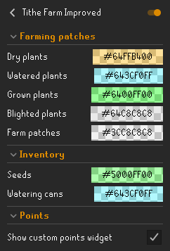

# Tithe Farm Improved - v0.4.1
Improve overall experience for Tithe farm.

## Plants progress
* Shows progress of dry plantsManager with game-tick precision
* Shows progress of watered plantsManager with game-tick precision
* Shows progress of grown plantsManager with game-tick precision
* Shows progress of blighted plantsManager with game-tick precision
* Highlights farm patch on mouse over

 

## Inventory highlights
* Highlights seeds

 

## Points widget
* Shows total points
* Show how many points will be added this run

 

## Settings

 

## Ground markers
Ground markers to do 25 plantsManager per run can be found from [here](./groundmarkers.txt). 

